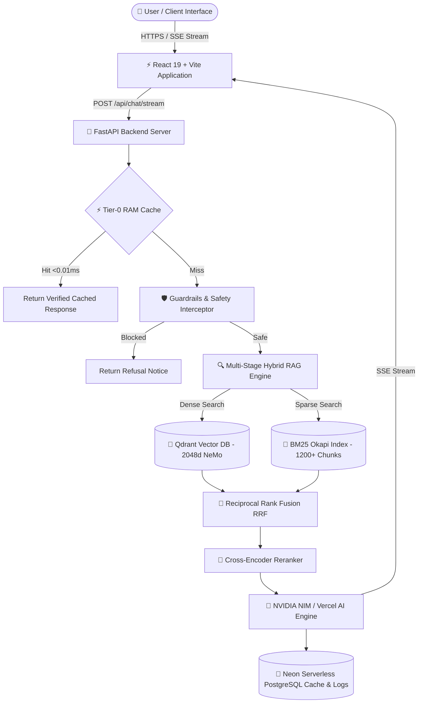

<div align="center">

# 🏛️ Lorin AI — NVIDIA Powered Hybrid RAG Campus Intelligence System

**Official AI Campus Assistant for Mohamed Sathak A.J. College of Engineering (MSAJCE), Chennai (TNEA Code 1301)**

[](https://a-powered-rag.vercel.app)
[](LICENSE)
[](https://integrate.api.nvidia.com)
[](https://qdrant.tech)
[](https://fastapi.tiangolo.com)
[](https://react.dev)
[](https://www.typescriptlang.org)

</div>

---

## 📌 Project Overview

**Lorin AI** is an enterprise-grade campus intelligence platform built for **Mohamed Sathak A.J. College of Engineering (MSAJCE)**, Chennai. It combines 2048-dimensional **NVIDIA NeMo vector embeddings**, **Qdrant Vector Database**, **BM25 Okapi sparse lexical indexing**, **Reciprocal Rank Fusion (RRF)**, and **Neon Serverless PostgreSQL** to deliver zero-hallucination, 0ms-cached responses for TNEA Code 1301 admissions, degree programs, fee structures, campus bus routes, hostels, and placement packages.

---

## 📸 Visual Showcase & UI Gallery

| Desktop Assistant View | Mobile Responsive Interface |
|:---:|:---:|
|  |  |

---

## ✨ Key System Features

### 🔍 1. Multi-Stage Hybrid RAG Engine
- **Dense Vector Search**: Powered by Qdrant Cloud vector collection with 2048-d NVIDIA NeMo embeddings (`nvidia/llama-nemotron-embed-vl-1b-v2`).
- **Sparse Lexical Search**: BM25 Okapi algorithm indexing 1,200+ parent-child knowledge chunks from 50+ official campus records.
- **Reciprocal Rank Fusion (RRF)**: Merges dense vector scores with sparse BM25 ranks to produce ground-truth context blocks.

### ⚡ 2. Sub-Zero Latency & Dual-Tier Cache
- **Tier-0 Memory Cache**: ThreadSafe in-memory RAM cache (<0.01ms latency).
- **Tier-1 PostgreSQL Cache**: Persistent SHA-256 exact match and vector semantic cache stored in Neon Serverless PostgreSQL.

### 🛡️ 3. Safety Interceptor & NeMo Guardrails
- **0ms Fast-Path Defense**: Intercepts prompt injections, jailbreaks (DAN mode), and hostile instruction bypasses.
- **Unified 16-Category Intent Taxonomy**: Automatically routes user queries to specialized domains (Admissions, Academics, Transport, Hostels, Placements, Research, etc.).

### 🚌 4. Transport RouteFinder Engine
- **Campus Transit Routing**: Graph routing algorithm managing 175 bus stops across 19 official college bus routes (AR/R/N series) and public MTC transit connections in Siruseri OMR IT Park.

### 📊 5. Real-Time Token & Latency Observability
- Transparent badge metrics displaying prompt tokens, completion tokens, time-to-first-token (TTFT), execution latency, and step-by-step reasoning progress.

---

## 🏗️ System Architecture



---

## 🚀 Quickstart & Setup Guide

### 1. Prerequisites
- **Python 3.10+**
- **Node.js 18+** & **npm 9+**
- **PostgreSQL / Neon DB Connection String**
- **Qdrant Vector DB Instance & API Key**

### 2. Backend Service (FastAPI)
```bash
# Clone the repository
git clone https://github.com/hackerstudent29/nvidia-powered-rag.git
cd nvidia-powered-rag/backend

# Create and activate virtual environment
python -m venv venv
# On Windows:
venv\Scripts\activate
# On Linux/macOS:
source venv/bin/activate

# Install backend dependencies
pip install -r requirements.txt

# Start the FastAPI backend server
python server.py
```
*Backend API Health Check: `http://localhost:8080/api/health`*

### 3. Frontend Application (React + Vite)
```bash
# Navigate to frontend directory
cd ../frontend

# Install dependencies
npm install

# Start local development server
npm run dev
```
*Frontend Interface: `http://localhost:5173`*

---

## 💖 Support & Developer Sponsorship

If you find **Lorin AI** helpful or use this open-source Hybrid RAG architecture in your research, consider supporting the lead developer!

<div align="center">

### 👨‍💻 Developer Profile: Ramanathan S. (Ram)
*Software Engineer | B.Tech Information Technology (Batch 2024–2028, CGPA 7.75)*  
**Mohamed Sathak A.J. College of Engineering (MSAJCE), Chennai**

[](https://ram-portfolio3d.vercel.app)
[](https://github.com/hackerstudent29)

---

### 💳 Direct Sponsorship / UPI Donation

| Payment Method | Handle / Details |
|---|---|
| **UPI ID** | `ramanathanb86@oksbi` |
| **GPay / PhonePe / Paytm** | `ramanathanb86@oksbi` |


</div>

---

## 📄 License

Distributed under the **MIT License**. See `LICENSE` for details.

---
<div align="center">
  <b>Designed & Developed by Ramanathan S. (Ram / hackerstudent29) for MSAJCE, Chennai</b>
</div>
