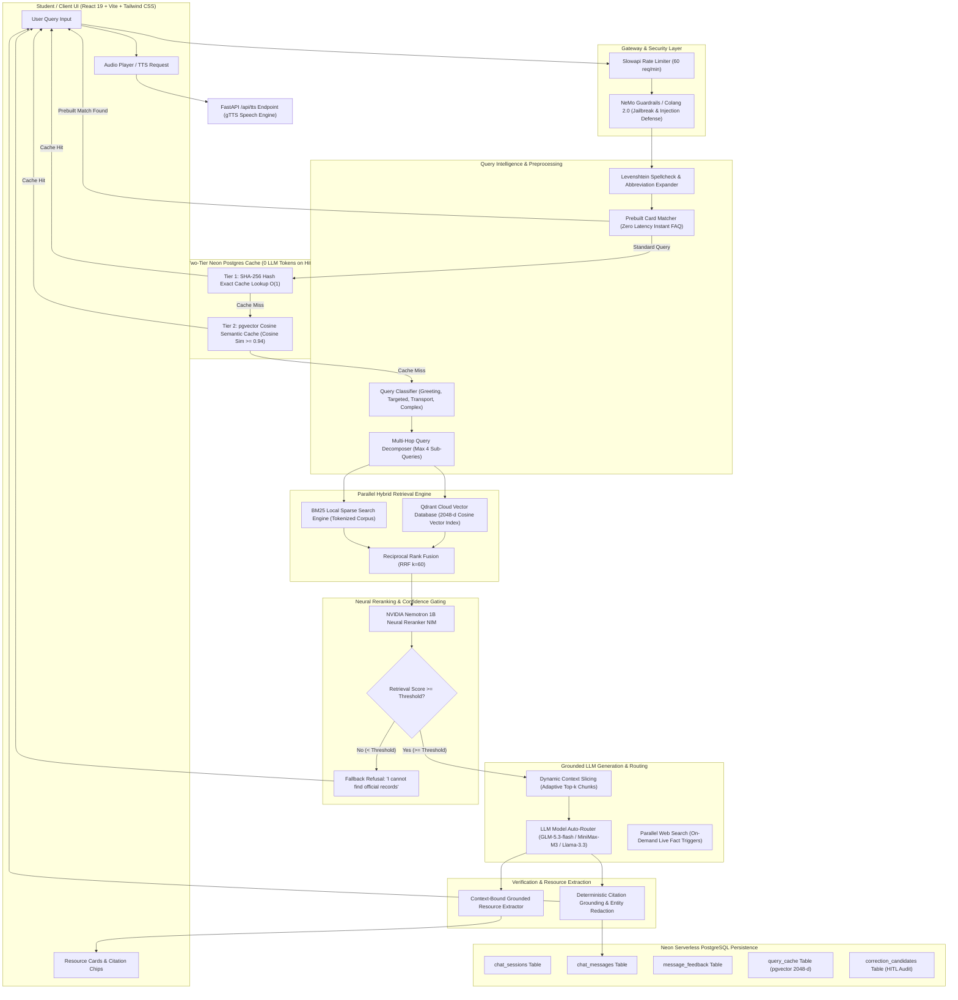

# 🏛️ Lorin AI – Master Architecture & Engineering Specification
**A Domain-Specific, Precision-Grounded Hybrid RAG Platform with NVIDIA AI Infrastructure & Neon Serverless Postgres**

---

## 1. Core Engineering Thesis & Research Question

> **Central Hypothesis:**  
> *"Can a domain-specific hybrid RAG architecture—enhanced with NVIDIA Nemotron neural reranking, verified Neon PostgreSQL two-tier semantic caching, dynamic sub-query decomposition, retrieval confidence gating, and human-in-the-loop correction—achieve higher factual accuracy, lower latency, and zero token waste compared to standard vector-search RAG systems?"*

---

## 2. NVIDIA Technology Classification (Runtime vs. Agent Workflows)

A rigorous architectural distinction is maintained between **Runtime Inference Components** (live production pipeline) and **NVIDIA Agent Skills** (developer/agent workflows for deployment, evaluation, and benchmarking):

```
┌────────────────────────────────────────────────────────────────────────────────────────┐
│                        NVIDIA AI PLATFORM INTEGRATION                                  │
│                                                                                        │
│  🔴 RUNTIME INFERENCE ENGINES (Live API)   🔵 AGENT SKILLS & DEV WORKFLOWS (Dev / CI) │
│  ├── NeMo Retriever NIMs (Dense Search)    ├── rag-blueprint (Deploy & Orchestrate)   │
│  ├── Nemotron Rerank 1B NIM (Reranker)     ├── rag-eval (RAGAS Accuracy Benchmarking) │
│  ├── NeMo Guardrails (Colang 2.0 Safety)   ├── rag-perf (aiperf Load & TTFT Testing)  │
│  └── Llama-3.3-70B / Nemotron NIM          ├── nemotron-retrieval-recipes (Tuning)    │
│                                            └── nemotron-policy-generator (Colang Gen) │
└────────────────────────────────────────────────────────────────────────────────────────┘
```

---

## 3. End-to-End System Architecture Blueprint

### A. Mermaid Sequence & Pipeline Diagram



---

### B. ASCII Comprehensive Data Flow Architecture

```
                                  ┌────────────────────────────────────────┐
                                  │       Student / Client Browser         │
                                  │   (React 19 + TypeScript + Tailwind)   │
                                  └───────────────────┬────────────────────┘
                                                      │ HTTPS / JSON / SSE Stream
                                                      ▼
┌────────────────────────────────────────────────────────────────────────────────────────────────────────┐
│                      FASTAPI ASGI BACKEND [Configured via rag-blueprint]                               │
│                                                                                                        │
│ 1. RATE LIMITING & SECURITY                                                                            │
│    └── Slowapi Token-Bucket Rate Limiter (60 req/min per IP)                                           │
│                                                                                                        │
│ 2. INPUT SAFETY & TOPIC GUARDRAILS [NeMo Guardrails / Policy by nemotron-policy-generator]             │
│    └── Runtime Colang 2.0 Guardrails: Intercepts prompt injections, jailbreaks & off-topic queries    │
│                                                                                                        │
│ 3. ZERO-TOKEN PREPROCESSING & DIRECT MATCHING                                                          │
│    ├── Text Normalization & Abbreviation Expander ("cse fee" ➔ "computer science engineering fee")     │
│    ├── Levenshtein Distance Spellchecker (Distance <= 2 against campus vocabulary)                     │
│    └── Prebuilt FAQ Card Matcher: Instant prebuilt cards for core campus topics (0ms LLM latency)      │
│                                                                                                        │
│ 4. TWO-TIER CACHING LAYER (0 LLM Generation Tokens on Cache Hit)                                      │
│    ├── Tier 1 Exact Lookup: SHA-256 Hash Index on `query_hash` (O(1) Memory Hash / O(log n) Postgres)   │
│    └── Tier 2 Semantic Lookup: HNSW Vector Index on `query_embedding` (2048-d, Cosine Sim >= 0.94)     │
│                                                                                                        │
│ 5. QUERY CLASSIFIER & CONDITIONAL DECOMPOSITION                                                        │
│    ├── Query Intent Classifier: Categorizes query (`greeting`, `targeted`, `transport`, `complex`)     │
│    ├── Simple Query (e.g. "What is the CSE fee?") ➔ Direct Hybrid Retrieval                            │
│    └── Multi-Hop Query (e.g. "Compare CSE vs IT placements & fees") ➔ Decompose into Sub-Queries      │
│         └── Preserves Sub-Query Branch Identity (Max 4 sub-queries, 10 candidates/branch, cap = 40)    │
│                                                                                                        │
│ 6. PARALLEL HYBRID RETRIEVAL & FUSION                                                                  │
│    ┌────────────────────────────────────────┐     ┌──────────────────────────────────────────┐         │
│    │        BM25 Sparse Search Engine       │     │        Dense Vector Search Engine        │         │
│    │  (Local in-memory index: Chunks)       │     │  (Qdrant Cloud: 2048-dim Cosine Index)   │         │
│    └───────────────────┬────────────────────┘     └────────────────────┬─────────────────────┘         │
│                        │                                               │                               │
│                        └──────────────────────┬────────────────────────┘                               │
│                                               ▼                                                        │
│                                Reciprocal Rank Fusion (RRF k=60)                                       │
│                                  └── Selects Top Candidate Pool                                        │
│                                                                                                        │
│ 7. NVIDIA NEMOTRON RERANKING & RETRIEVAL CONFIDENCE GATE [nemotron-retrieval-recipes]                  │
│    └── Model: `nvidia/llama-nemotron-rerank-1b-v2`                                                     │
│                                                                                                        │
│            ┌──────────────────────────────────┴──────────────────────────────────┐                     │
│            ▼                                                                     ▼                     │
│    [Score < Calibrated Threshold: Low]                                   [Score >= Threshold: High]    │
│    Bypass LLM ➔ Fallback Refusal:                                        Dynamic Context Slicing:      │
│    "I cannot find official records on this."                             • Simple: Top 1–2 Chunks      │
│                                                                          • Normal: Top 2–3 Chunks      │
│                                                                          • Multi-Hop: Top 4–6 Chunks   │
│                                                                                  │                     │
│ 8. GROUNDED LLM GENERATION & MODEL AUTO-ROUTER                                   │                     │
│    ├── Session Context: Last 2–3 message turns only (prevents token bloat)       │                     │
│    ├── Primary LLM: `zai/glm-5.3-flash` (via Vercel AI Gateway) ◄────────────────┘                     │
│    ├── Secondary LLM: `minimax/minimax-m3` (Multi-turn dialogue synthesis)                             │
│    ├── Fallback & Verification LLM: `google/gemini-2.5-flash-lite`                                     │
│    └── Web Search Tool: `parallel/search` [PREMIUM GATED: ONLY on external/live query triggers]        │
│                                                                                                        │
│ 9. POST-PROCESSING & RESOURCE EXTRACTION                                                               │
│    ├── Deterministic Citation & Grounding Validator: Rejects unsupported citation references           │
│    ├── Entity & Phone Number Redaction: Sanitizes raw internal tags and phone numbers                 │
│    └── Context-Bound Resource Extractor (`extract_grounded_resources`): Extracts official PDFs, links  │
│        and department resources strictly bound to retrieved chunk metadata                             │
│                                                                                                        │
│ 10. PERSISTENCE & HUMAN-IN-THE-LOOP (HITL) AUDIT (Neon PostgreSQL)                                     │
│    ├── Store session & streaming response in `chat_sessions` & `chat_messages`                         │
│    ├── Log user feedback (Thumbs Up / Down) to `message_feedback`                                      │
│    ├── Feedback-Driven Nemotron Regeneration endpoint `/api/feedback/regenerate-nemo`                 │
│    └── Populate `correction_candidates` for self-healing admin curation                                │
└───────────────────────────────────────────────┬────────────────────────────────────────────────────────┘
                                                │
                                                ▼
                               ┌─────────────────────────────────┐
                               │   Verified Grounded Response    │
                               └─────────────────────────────────┘
```

---

## 4. In-Depth Subsystem Design & Technical Specifications

### A. Embedding & Vector Index Pipeline
```text
Document Ingestion:
Raw Document ──► NVIDIA NeMo Embed VL 1B NIM ──► 2048-dim Vector ──► Qdrant Cloud Upsert

Query Execution:
User Query   ──► NVIDIA NeMo Embed VL 1B NIM ──► 2048-dim Vector ──► Qdrant Cosine Search
                                                                            │
                                                                            ▼
                                                Top Dense Candidates (Input to RRF)
```
* **Embedding Model Consistency:** `nvidia/llama-nemotron-embed-vl-1b-v2` generating **2048-dimensional** dense vectors across Qdrant, document ingestion, query embedding, and Neon PostgreSQL semantic cache.
* **Reranking Stage:** The **Nemotron Reranker 1B NIM** (`nvidia/llama-nemotron-rerank-1b-v2`) operates strictly **after** RRF hybrid fusion, scoring and re-ordering the top candidate pool.

---

### B. Two-Tier Cache Architecture in Neon Serverless PostgreSQL
The caching subsystem implements two distinct index structures to guarantee instant zero-token responses on repeated or semantically equivalent questions:

1. **Tier 1 (Exact Cache):** Hash lookup via SHA-256 indexed key (`query_hash VARCHAR(64) PRIMARY KEY`); $O(1)$ in-memory hash cache, $O(\log n)$ through PostgreSQL B-tree indexing.
2. **Tier 2 (Semantic Vector Cache):** Cosine similarity ($\ge 0.94$) lookup using an HNSW vector index on `query_embedding vector(2048)` in Neon PostgreSQL.

#### Neon PostgreSQL Database Schema (`init_db.py`)
```sql
-- 1. Chat Sessions
CREATE TABLE IF NOT EXISTS chat_sessions (
    session_id VARCHAR(64) PRIMARY KEY,
    user_ip VARCHAR(45),
    user_agent TEXT,
    created_at TIMESTAMP WITH TIME ZONE DEFAULT NOW(),
    last_active_at TIMESTAMP WITH TIME ZONE DEFAULT NOW()
);

-- 2. Chat Messages
CREATE TABLE IF NOT EXISTS chat_messages (
    message_id VARCHAR(64) PRIMARY KEY,
    session_id VARCHAR(64) REFERENCES chat_sessions(session_id) ON DELETE CASCADE,
    role VARCHAR(20) NOT NULL CHECK (role IN ('user', 'assistant', 'system')),
    content TEXT NOT NULL,
    citations JSONB DEFAULT '[]'::jsonb,
    model_used VARCHAR(100),
    latency_ms FLOAT,
    token_usage JSONB DEFAULT '{}'::jsonb,
    is_cached BOOLEAN DEFAULT FALSE,
    created_at TIMESTAMP WITH TIME ZONE DEFAULT NOW()
);

CREATE INDEX IF NOT EXISTS idx_chat_messages_session_id ON chat_messages(session_id);

-- 3. Message Feedback (Thumbs Up / Down)
CREATE TABLE IF NOT EXISTS message_feedback (
    feedback_id VARCHAR(64) PRIMARY KEY,
    message_id VARCHAR(64) REFERENCES chat_messages(message_id) ON DELETE CASCADE,
    session_id VARCHAR(64),
    rating VARCHAR(20) NOT NULL CHECK (rating IN ('thumbs_up', 'thumbs_down')),
    feedback_text TEXT,
    created_at TIMESTAMP WITH TIME ZONE DEFAULT NOW()
);

-- 4. Query Cache (Zero-Token Exact & Semantic Vector Cache)
CREATE TABLE IF NOT EXISTS query_cache (
    query_hash VARCHAR(64) PRIMARY KEY,
    query_embedding vector(2048),
    query_text TEXT NOT NULL,
    answer_text TEXT NOT NULL,
    source_chunks JSONB DEFAULT '[]'::jsonb,
    document_version VARCHAR(50) DEFAULT '2026-27',
    is_current BOOLEAN DEFAULT TRUE,
    confidence_score FLOAT DEFAULT 1.0,
    is_admin_verified BOOLEAN DEFAULT FALSE,
    hit_count INT DEFAULT 0,
    created_at TIMESTAMP WITH TIME ZONE DEFAULT NOW(),
    last_hit_at TIMESTAMP WITH TIME ZONE DEFAULT NOW()
);

CREATE INDEX IF NOT EXISTS idx_query_cache_is_current ON query_cache(is_current);

-- 5. Self-Healing Correction Candidates (from human feedback audit)
CREATE TABLE IF NOT EXISTS correction_candidates (
    candidate_id VARCHAR(64) PRIMARY KEY,
    message_id VARCHAR(64),
    user_query TEXT NOT NULL,
    bot_answer TEXT NOT NULL,
    issue_type VARCHAR(50) CHECK (issue_type IN ('USER_DISSATISFACTION', 'FACTUAL_ERROR', 'AMBIGUITY', 'OUTDATED_INFO')),
    proposed_correction TEXT,
    status VARCHAR(20) DEFAULT 'PENDING' CHECK (status IN ('PENDING', 'APPROVED', 'REJECTED', 'APPLIED')),
    admin_notes TEXT,
    created_at TIMESTAMP WITH TIME ZONE DEFAULT NOW(),
    reviewed_at TIMESTAMP WITH TIME ZONE
);
```

---

### C. Balanced Multi-Hop Sub-Query Decomposition
To prevent dominant topics from starving parallel sub-queries (e.g., retrieving 5 CSE chunks and 0 IT chunks during comparison):
* Decomposes complex questions into isolated sub-queries ($Q_1, Q_2, \dots, Q_n$).
* Retrieves Top-$K$ candidates for each sub-query independently.
* **Explicit Bounds & Caps:**
  ```text
  Maximum sub-queries = 4
  Top-K per sub-query = 10
  Maximum pre-rerank candidates cap = 40
  ```
* Constructs a balanced candidate pool before passing to the Nemotron Reranker.

---

### D. Dynamic Context Slicing (Adaptive Top-$k$)
* **Simple Factoid Queries (`greeting` / `targeted`):** Pass **Top 1–2 Chunks** (~250 tokens context).
* **Standard Queries (`transport` / `general`):** Pass **Top 2–3 Chunks** (~400 tokens context).
* **Multi-Hop Comparative Queries (`complex`):** Pass **Top 4–6 Chunks** across sub-queries (~800 tokens context).

---

### E. Retrieval Confidence Gate vs. Grounding Validation
* **Stage 1 (Retrieval Confidence Gate):** Evaluates reranker relevance score. If $\text{Score} < \theta$ (calibrated via benchmark sweep), execution aborts before LLM invocation.
* **Stage 2 (Output Grounding Validator):** A deterministic post-processor **validates that citations reference retrieved chunks and rejects responses containing unsupported citation references** before returning to the user.

---

### F. Context-Bound Resource Extraction (`extract_grounded_resources`)
To permanently eliminate file attachment hallucinations (e.g. attaching lab manuals to general queries):
1. **Context-Bound Extraction:** Resource attachments are extracted strictly from the top 6 grounded RAG chunks (`retrieved_chunks`) retrieved for the specific user query. Un-retrieved catalog items are never attached.
2. **Direct Link Parsing:** Markdown URLs and links embedded within retrieved chunk text are extracted and verified against official campus records.
3. **Intent-Driven Filtering:** When explicit file trigger words (`pdf`, `download`, `syllabus`, `photo`, `video`, etc.) are absent, attachments are strictly filtered to require explicit title keyword overlap with the query.

---

### G. Smart On-Demand Web Search Policy (`parallel/search`)
Web search is configured as an **On-Demand External Tool** and is triggered strictly when necessary:
1. **Local-First Default:** All regular and domain-specific questions (fees, syllabus, admissions, hostels, transport, faculty, placements, NAAC, policies) are answered 100% locally from the Qdrant + BM25 campus knowledge base and vector cache.
2. **On-Demand Search Trigger:**
   - **Condition:** The query specifically asks for live external facts outside the static campus records (e.g., *"latest Anna University circular published today"*, *"current traffic/weather near Siruseri right now"*).
   - In those instances, `parallel/search` fetches the live facts to ground the answer accurately.
3. **Execution Tooling:**
   - Search Tool: `parallel/search`
   - Fallback & Verification Engine: `google/gemini-2.5-flash-lite`

---

## 5. Complete Backend API Endpoint Specification (`server.py`)

The FastAPI ASGI server provides 14 production endpoints:

| Endpoint Path | HTTP Method | Description | Primary Payload / Response |
| :--- | :--- | :--- | :--- |
| `/api/chat/stream` | `POST` | Asynchronous Server-Sent Events (SSE) streaming chat endpoint | Streamed tokens, thinking steps, citations, token metrics |
| `/api/chat` | `POST` | Synchronous JSON chat completion endpoint | JSON object with full answer, citations, and resource cards |
| `/api/chat/history/{session_id}` | `GET` | Retrieves full conversation history for a given session | JSON array of past messages with model & latency metadata |
| `/api/sessions` | `GET` | Lists active and historical chat sessions | JSON list of session metadata |
| `/api/sessions/{session_id}` | `GET` | Fetches details for a single session | Session object details |
| `/api/sessions/{session_id}` | `DELETE` | Deletes a session and all associated messages | Confirmation status |
| `/api/cache/clear` | `POST` / `DELETE` | Clears local and Neon Postgres vector query cache | Status confirmation & count of cleared cache entries |
| `/api/feedback` | `POST` | Records user feedback (Thumbs Up / Down) | Inserts into `message_feedback` & `correction_candidates` |
| `/api/feedback/regenerate-nemo` | `POST` | Triggers Nemotron-driven re-generation following negative feedback | Re-evaluates context with Nemotron reranker & fresh prompt |
| `/api/models` | `GET` | Returns list of available LLMs & active auto-selected router model | JSON list of model identifiers & descriptions |
| `/api/stats` | `GET` | Returns global system token metrics, latency stats, and cache hits | Token accounting, P50/P95 latency, total sessions |
| `/api/health` | `GET` | System health check (DB connectivity, Qdrant status, BM25 count) | Status 200 OK with health indicators |
| `/api/tts` | `POST` | Text-to-Speech audio synthesis engine | MP3 audio stream / base64 audio response |

---

## 6. Frontend Web Architecture (React 19 + Vite + Tailwind CSS)

### A. Component Hierarchy (`frontend/src`)

```text
src/
├── App.tsx                     # Main layout & state manager (active session, messages, settings)
├── main.tsx                    # Application entrypoint & React DOM render
├── index.css                   # Custom MSAJCEA CSS design system & dynamic keyframe animations
├── components/chat/
│   ├── AmbientBackground.tsx    # Animated dynamic background with subtle glassmorphism
│   ├── ChatHeader.tsx          # Top nav with token cost badges, session switcher, stats toggle
│   ├── ChatInput.tsx           # Textarea with auto-resize, speech recognition, model dropdown
│   ├── HeroGreeting.tsx        # Zero-state prompt suggestion cards & welcome header
│   ├── MessageItem.tsx         # Message renderer with Markdown, Code blocks, Audio player, Feedback buttons
│   ├── ThinkingState.tsx       # Accordion step-by-step thinking breakdown (Retrieval ➔ RRF ➔ Rerank)
│   ├── TokenCostBadge.tsx      # Real-time token usage badge (Prompt, Completion, Latency, Cost)
│   ├── SourceChip.tsx          # Clickable grounded citation chips with document source viewer
│   ├── ResourceCards.tsx       # Downloadable PDF/Resource cards extracted strictly from context
│   ├── SessionDrawer.tsx       # Sliding sidebar for switching and deleting chat sessions
│   ├── StatsModal.tsx          # Performance modal displaying live global token metrics & cache hits
│   └── FeedbackModal.tsx       # Curation modal for submitting detailed thumbs-down corrections
```

---

## 7. Offline Evaluation & Complete Ablation Matrix

### A. Two-Stage Evaluation Metrics Framework

```text
1. Retrieval Evaluation (Did we find the right documents?)
   ├── Recall@1, Recall@3, Recall@5
   ├── Precision@1, Precision@3
   ├── Mean Reciprocal Rank (MRR)
   ├── NDCG@K
   └── Context Precision & Context Recall (RAGAS)

2. Generation Evaluation (Did the LLM answer correctly from context?)
   ├── Faithfulness (Target: > 0.95)
   ├── Answer Relevancy (Target: > 0.90)
   └── Factual Correctness
```

---

### B. Complete Ablation Experiment Suite

| Experiment | Architecture Configuration | Metric Focus | Primary Goal |
| :--- | :--- | :--- | :--- |
| **Exp A** | Dense Vector Search Only (Qdrant) | Retrieval (Recall/MRR) | Baseline semantic retrieval |
| **Exp B** | Sparse Search Only (BM25) | Retrieval (Recall/MRR) | Baseline lexical retrieval |
| **Exp C** | Dense + BM25 (Unweighted Fusion) | Retrieval (Recall/MRR) | Simple hybrid baseline |
| **Exp D** | Dense + BM25 + Reciprocal Rank Fusion (RRF) | Retrieval (Recall/MRR) | Rank-fused hybrid retrieval |
| **Exp E** | Dense + BM25 + RRF + **Nemotron Reranker 1B** | Retrieval & Generation | Impact of neural reranking |
| **Exp F** | Exp E + **Retrieval Confidence Gating** | Generation (Faithfulness) | Impact of hallucination refusal gate |
| **Exp G** | Exp F + **Verified Neon Vector Cache** | **Efficiency & Latency** | Latency & token-reduction impact |

---

## 8. Performance & Concurrency Load Profiling (`rag-perf` with `aiperf`)

### Concurrency Stress Levels:
* **10 Concurrent Requests:** Normal production load baseline.
* **25 Concurrent Requests:** Moderate traffic (lunch hours / breaks).
* **50 Concurrent Requests:** High load (admission announcement spikes).
* **100 Concurrent Requests:** Stress / failure boundary test.

### Target Performance Metrics:

| Metric | Engineering Target | Validation Tool |
| :--- | :--- | :--- |
| **P50 Time-to-First-Token (TTFT)** | **$< 400\text{ ms}$ (Target)** | `rag-perf` (`aiperf`) |
| **P95 / P99 TTFT** | **$< 900\text{ ms} / < 1.4\text{ s}$** | `rag-perf` (`aiperf`) |
| **End-to-End Latency** | **$< 1.5\text{ s}$ (P50)** | Langfuse live tracing |
| **Average Token Budget per Query** | **$< 500\text{ tokens}$** | Langfuse token accounting |
| **Cache Hit Token Cost** | **$0\text{ LLM Generation Tokens}$** | Neon Vector Cache logs |
